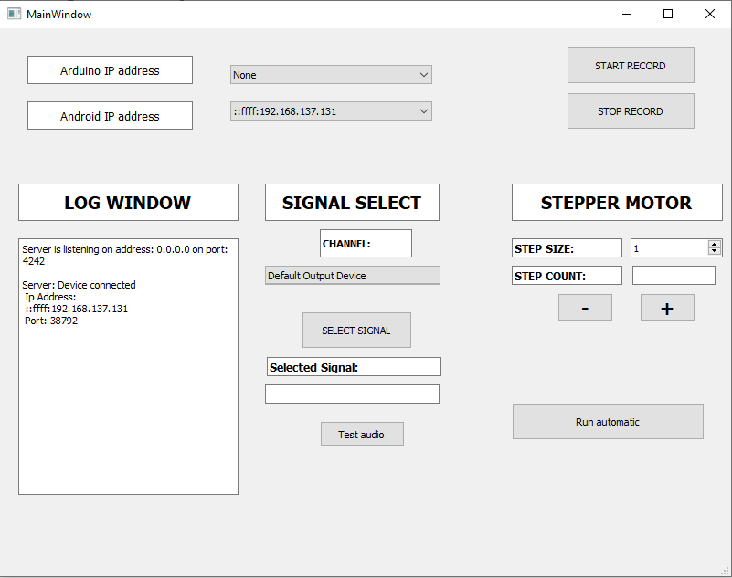
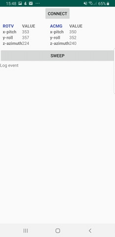
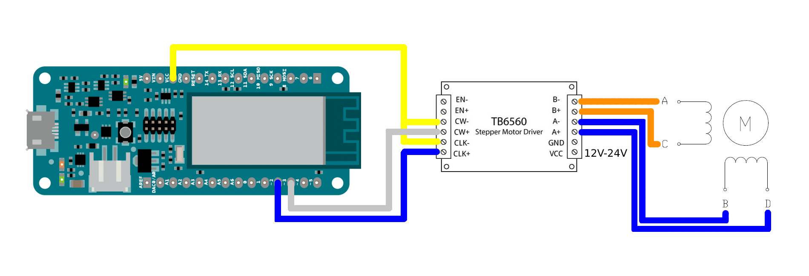

# Project 1: Polar Pattern Measurement
This project consists of four key programs. Note that both the Android and Arduino device must be connected to the PC using a WiFi hotspot.

## Server side tutorial
The first program, **SERVER**, runs a Transmission Control Protocol (TCP) server, written in C which controls the flow of the measurement.
The executable is found under *AudioStorOrientalServer/Release/AudioStorOrientalServer.exe*. When you run this program, the main window will open. Once a device (Android or Arduino) is connected, the message log on the bottom left will show this.
For example if the Android smartphone connects to the PC using its Android application (discussed below), the following message is seen:

You still have to select the correct IP address of the Android and Arduino device. Failing to do so correctly will cause the program to shut down.
The next step is to select the correct output channel and the corresponding signal. All signal types should be stored in the folder *SERVER/AudioStorOrientalServer/Signals* and have .wav extension. 
Once the signal is select you can test the audio with the *Test audio* button.
The last step is to set the step size of the motor. Each step is 1.8°. Therefore to replicate the measurement, set the step size to 9 degrees. The arduino will send a confirmation command back if the step size is received correctly. 

* Note that you have to align the stepper motor of the Arduino manually with the speaker.*

Once everything works, press the *Run Automatic* button. This will start a synchronized process of recordings.
The process is as follows:
<ol>
  <li> The server sends a command to the Android to start recording and waits for a confirmation of the Android.</li>
  <li> The server receives confirmation of the Android and plays the selected signal. </li>
  <li> Once the selected signal is finished playing, the server sends a command to the Android to stop recording and send the recording back to the server. </li>
  <li> Once the recording is received and stored at the server-side, the server sends a command to the Arduino to rotate the stepper motor with the specified step size. The step count is incremented. </li>
  <li> One iteration of the process is finished. Return to 1. </li>
</ol>
The number of iterations depends on the specified step size. For a step size of 9° the process will have 40 iterations.
  
## Android side tutorial
The application on the Android is a multi-threaded program which runs a TCP client in one thread and a mediarecorder in the second thread. The main thread handles synchronization of the threads and also calculates the rotation of the smartphone.
The UI is kept simple as seen here.

Before the server can actually run, you have to press the *connect* button on the Android application to connect with the server program.
Afterwards the Android application is completely controlled by the server.

## Arduino side considerations
The android smartphone is rotated by a stepper motor which is controlled by an arduino. This arduino send commands to a motor controller board which in turn sends current through a particular winding of the stepper motor.
A 12V, 1.5A power supply is connected to the motor controller which provides the high currents needed for the stepper motor.
The wiring of the stepper motor, controller and arduino are shown here.

To provide the arduino with power it is connected to a laptop via a USB cable. Since the arduino can receive commands both via WiFi and via this USB cable connecting it to a laptop allows the user to rotate the smartphone manualy before a measurement procedure is started.
When first powering the arduino it will continuously try to connect to the hotspot defined by the 'ssid' variable in the PolarGrabber.ino.
Once a connection is established the arduino tries to connect to the server as defined by the 'server' variable. 
Afterwards the arduino waits until it receives a command, be it via WiFi or via USB.
The text file 'commands.txt' contains all integers that can be interpreted by the arduino. Typing '5' and '6', which correspond to 'takeOneStepCLKWise' and 'takeOneStepCounterCLKWise' respectively, into the serial monitor rotates the stepper motor. 
Once the smartphone is oriented correctly, meaning the bottom microphone is pointing to the speaker, '0' can be sent to the arduino to calibrate the current orientation as the origin. 
After the origin is set the measurement procedure can be started by pressing the *Run Automatic* button of the server.

### A note on the stepper motor controller board 
The polarity of the wiring does not matter, as long as each pair (denoted by a color) are connected to the same letter.  
Additionally, the controller has many settings which, among other things, determine how much current goes to the motor windings. We played around with these settings until we found one where the stepper motor rotated the smartphone smoothly. If these settings are not fine-tuned to the weight of the smartphone the motor rotates the stepper motor can overshoot each time it takes a step.
